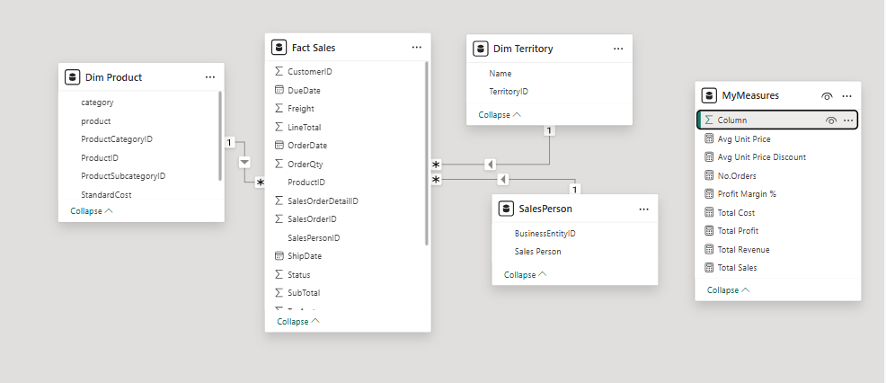
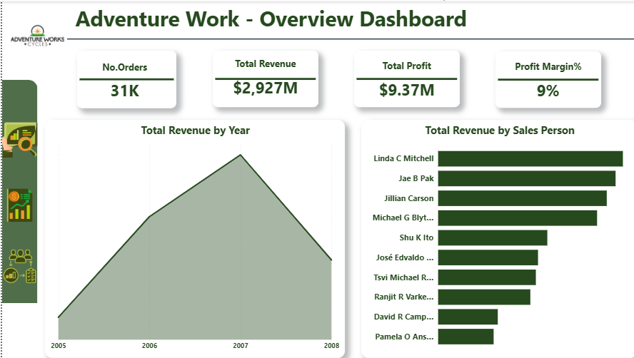

# 📊 AdventureWorks Sales Analysis

##   Project Goal

This analysis aims to understand sales and profitability performance across products and regions, answering key business questions:  

- Why do some regions sell more but earn less profit?  
- Which products drive profitability?  
- How does product mix affect revenue and profit margins?  

---

##  Data Modeling (Star Schema)

A **Star Schema** was built to enable structured analysis:

- **Fact Table:** Sales  
- **Dimensions:** Product, Category, Territory, Time  

This structure allows multi-dimensional analysis to explore the relationship between sales and profitability by region and product.

---

## 🔎 Analysis Journey

### 1️⃣ Dashboard Overview – KPIs  
- Created an **Overview dashboard** highlighting key KPIs:  
  - Total revenue over years  
  - Total revenue by Salesperson  
- Observed an overall increase in revenue, with noticeable changes in two specific years.

---

### 2️⃣ Monthly Analysis  
- Focused on those two years and created a **month-by-month profit dashboard**.  
- Found that **June showed a drop in profitability**.  
- Investigated **Avg Unit Price** and **Avg Unit Price Discount** for June:  
  - Bikes sold at high prices  
  - Discounts were also high  
- Created a chart showing **profit by category** to understand category-level impact.

---

### 3️⃣ Regional Profitability  
- Analyzed **total sales and profit margin by region**.  
- Observed:  
  - Some regions have low sales but high profit margins  
  - Some regions have high sales but low profit margins  
- Checked **average discount per region** → high across all regions → **not the main cause**.

---

### 4️⃣ Product-Level Insights  
- Examined products within each region:  
  - High-sales, low-margin regions → top profitable product: **Accessories**  
  - Bikes had low profit margin  
- Checked revenue and profit per product:  
  - Bikes → high revenue, low margin  
  - Accessories → low revenue, high margin  
- Examined order count by region and product:  
  - Low-sales, high-margin regions → Bikes & Accessories sold almost equally  
  - High-sales, low-margin regions → more Accessories sold than Bikes  

---

### 5️⃣ Final Insight – Revenue vs Profitability  
- **Bikes** = main revenue driver  
- **Accessories** = main profit driver  
- Profitability depends on **product mix per region**, not just sales volume.

---

## 💡 Analytical Approach  

The analysis followed a structured thinking process:  

1. **Identify performance gaps** – noticed low profitability in certain months and regions  
2. **Test assumptions** – analyzed discount impact  
3. **Drill down into products** – evaluated revenue vs profit per product  
4. **Draw insights** – profitability is influenced more by product mix than sales volume  

---

## 📈 Dashboards

### 🏠 Home Dashboard

### Other Dashboards
  

 

---

# 🎯 Conclusion

This project is **more than just a data presentation**. It’s a structured, analytical solution to a real business problem.  

Anyone reviewing it can immediately understand:  

- Your thought process  
- Analytical methodology  
- Insights before viewing the charts

